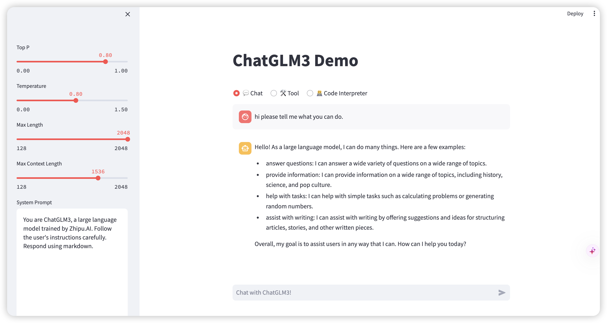
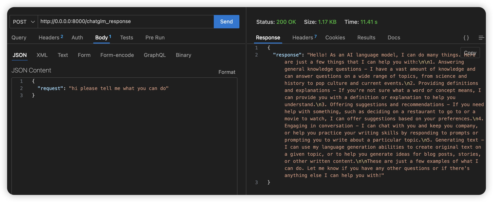

# Mastering On-Premises AI: An Exploration of Deploying CHATGLM

Deploying open-source Language Model (LLMs) on-premises offers a robust solution for real-world scenarios where data privacy is a primary concern for individuals or companies. In my own exploration, I utilized CHATGLM, a Chinese-English bilingual pre-trained model, for practical purposes.

The initial requirements of chatglm3 demanded 13GB of GPU memory, which often exceeds the capabilities of personal PCs or laptops. To address this constraint, I experimented with quantizing the model, a process outlined below:

```bash
git clone --recursive https://github.com/li-plus/chatglm.cpp.git && cd chatglm.cpp
python3 -m pip install -U pip
python3 -m pip install torch tabulate tqdm transformers accelerate sentencepiece
python3 chatglm_cpp/convert.py -i THUDM/chatglm3-6b -t q4_0 -o chatglm-ggml.bin  
# You are free to try any of the below quantization types by specifying -t <type>:

# q4_0: 4-bit integer quantization with fp16 scales.
# q4_1: 4-bit integer quantization with fp16 scales and minimum values.
# q5_0: 5-bit integer quantization with fp16 scales.
# q5_1: 5-bit integer quantization with fp16 scales and minimum values.
# q8_0: 8-bit integer quantization with fp16 scales.
# f16: half precision floating point weights without quantization.
# f32: single precision floating point weights without quantization.
```


In case of failure, create a 'THUDM/chatglm3-6b' folder within your 'chatglm.cpp' directory and manually download all files from [here](https://huggingface.co/THUDM/chatglm3-6b/tree/). Then, rerun the conversion process:

```bash
python3 chatglm_cpp/convert.py -i THUDM/chatglm3-6b -t q4_0 -o chatglm-ggml.bin
```

Following the successful completion of the conversion, you'll acquire a file named "chatglm-ggml.bin," ready for sharing or utilization in establishing personalized services.

## Local machine deployment
To deploy the model on your local machine, follow these steps:
```bash
conda create -n chatglmcpp python=3.8 #Create a new Conda environment named chatglmcpp with Python 3.8
conda activate chatglmcpp 
git clone -b demo git@github.com:QiongzhuLi/chatglm_cpp_test.git  ## only clone the demo branch
mkdir models  ## You need to place the 'chatglm-ggml.bin' you just made into this folder
pip install -r requirements.txt
```
Additionally, I've provided the bin file for your convenience, accessible [here](https://drive.google.com/file/d/1J7EWPZKvi4yP514roGA2KqmQgFazHz6n/view?usp=sharing). Following the aforementioned steps, you can now employ your local LLM by executing the following code in your terminal:

```bash
streamlit run api/chatglm3_demo.py 
```
This action will grant you access to an interface similar to the one depicted below, accessible at http://localhost:8501. Enjoy exploring the functionalities of your local LLM!



Should you wish to integrate this model into your application via an API, you can reference the following piece of code:

```bash
python api/main.py
```
You can test the functionality of your API using tools such as "thunder light" in VSCode or Postman, or any other framework you're familiar with.




## Docker Deployment
I've crafted a basic version of a Dockerfile to facilitate the creation of your Docker image. You can build your image by executing:
```
docker build -t chatglm3_cpp .
```
Once your image is built, initiate your container using either of the following commands:
```
docker run -v /Users/qiongzhuli/Documents/gpt/chatglm_cpp_test/models/:/app/models/ -p 8000:8000 --name chatglm_cpp_c chatglm3_cpp:latest
```
or
```
docker-compose up
```


### Error handling
If you encounter errors during the deployment process, follow these steps for resolution:

1. If you encounter the error below, first execute ```docker pull ubuntu:20.04```:  
```
ERROR: failed to solve: ubuntu:20.04: failed commit on ref "unknown-sha256:1568392b0df36dd09a48d9e1388f19e31c705738493a05a416104511fae584b1": "unknown-sha256:1568392b0df36dd09a48d9e1388f19e31c705738493a05a416104511fae584b1" failed size validation: 8144 != 7816: failed precondition

View build details: docker-desktop://dashboard/build/desktop-linux/desktop-linux/hc0ala8gzygseopryo04je3tb
```
2. If you encounter the following error, disconnect from your VPN:

```
Dockerfile:8
--------------------
   7 |     # apt
   8 | >>> RUN \
   9 | >>>     sed -e "s/archive.ubuntu.com/mirrors.tuna.tsinghua.edu.cn/g" \
  10 | >>>         -e "s/security.ubuntu.com/mirrors.tuna.tsinghua.edu.cn/g" -i /etc/apt/sources.list && \
  11 | >>>     apt update && \
  12 | >>>     DEBIAN_FRONTEND=noninteractive apt install -yq --no-install-recommends \
  13 | >>>         gcc g++ make python3-dev python3-pip python3-venv && \
  14 | >>>     rm -rf /var/lib/apt/lists/*
  15 |     
--------------------
ERROR: failed to solve: process "/bin/sh -c sed -e \"s/archive.ubuntu.com/mirrors.tuna.tsinghua.edu.cn/g\"         -e \"s/security.ubuntu.com/mirrors.tuna.tsinghua.edu.cn/g\" -i /etc/apt/sources.list &&     apt update &&     DEBIAN_FRONTEND=noninteractive apt install -yq --no-install-recommends         gcc g++ make python3-dev python3-pip python3-venv &&     rm -rf /var/lib/apt/lists/*" did not complete successfully: exit code: 100

View build details: docker-desktop://dashboard/build/desktop-linux/desktop-linux/47ckt2dcbs1c7e3nldlrxnaqh
```
These steps should help resolve common errors encountered during the deployment process.

In today's data-driven landscape, the ability to harness the power of AI while safeguarding data privacy is indispensable. With the tools and techniques discussed here, you're equipped to leverage on-premises AI solutions effectively, empowering your organization to thrive in a privacy-conscious environment. Start deploying your own LLM today and experience the transformative impact it can have on your real-world applications.